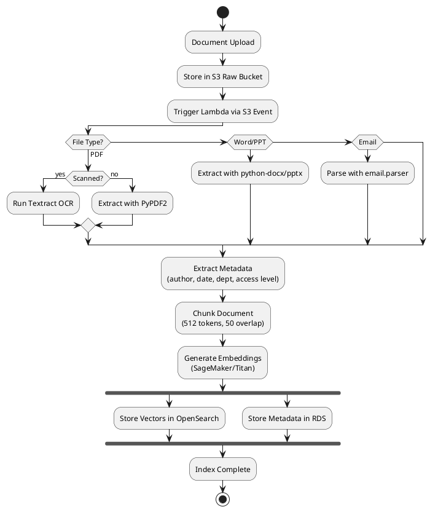
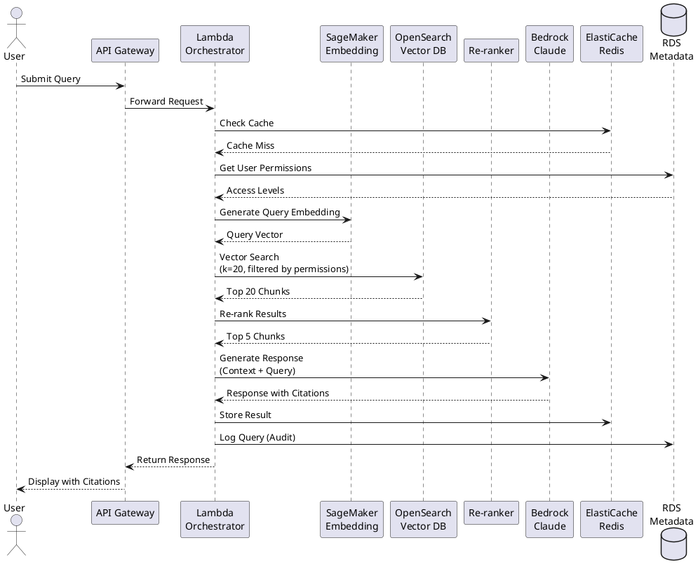
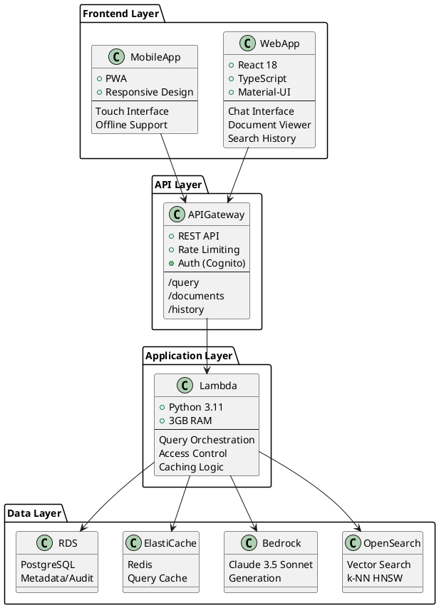
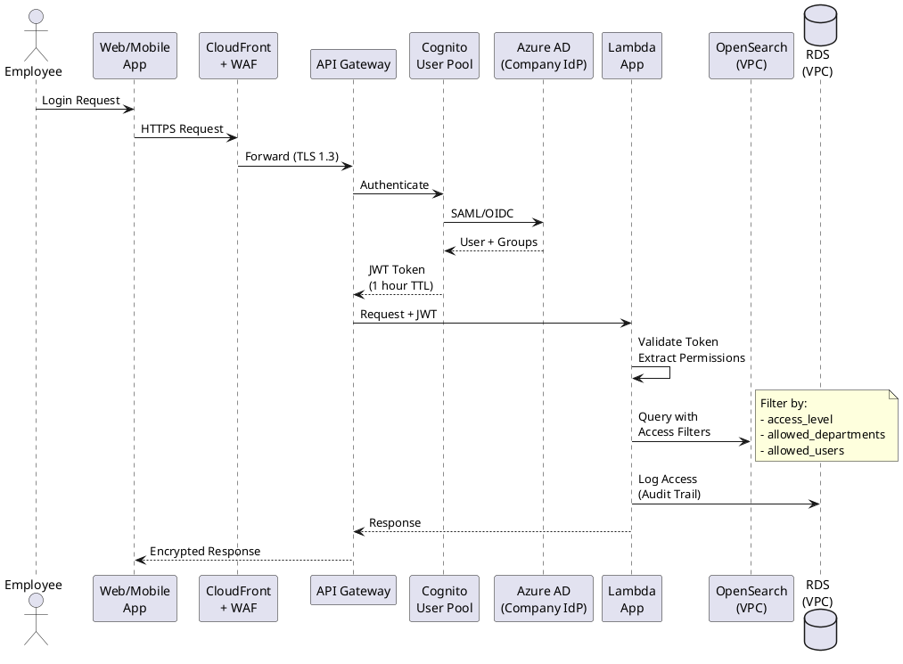
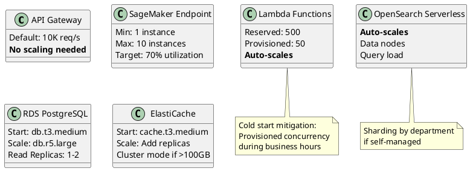
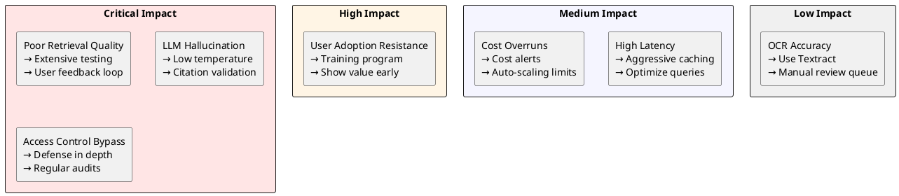

# Cloud Test: Enterprise RAG System Architecture

**Author**: Cloud Architecture Design Submission
**Date**: November 2025

---

## Table of Contents

1. [Assumptions](#1-assumptions)
2. [High-Level Architecture](#2-high-level-architecture)
3. [Ingestion and Indexing Pipeline](#3-ingestion-and-indexing-pipeline)
4. [RAG Retrieval + Response Logic](#4-rag-retrieval--response-logic)
5. [User Interface + Application Layer](#5-user-interface--application-layer)
6. [Security Architecture](#6-security-architecture)
7. [Scaling Strategy](#7-scaling-strategy)
8. [Cost Strategy](#8-cost-strategy)
9. [Risks, Tradeoffs, and Alternatives](#9-risks-tradeoffs-and-alternatives)

---

## 1. Assumptions

### Document Volume & Characteristics
- **Total Documents**: Approximately 100,000 documents accumulated over 10+ years
- **Document Types**: 60% PDFs, 25% Word documents, 10% PowerPoint, 5% emails/other
- **Average Document Size**: 2-5 MB per document
- **Total Storage**: Approximately 300-500 GB of raw documents
- **Growth Rate**: Approximately 10,000 new documents per year (~800/month)

### Update Frequency & Access Patterns
- **Batch Uploads**: Weekly bulk uploads of 50-200 documents
- **Real-time Indexing**: Required for newly added documents within 15 minutes
- **Query Volume**: Approximately 2,000-5,000 queries per day (average 3 queries/user/week)
- **Peak Usage**: Business hours (9 AM - 5 PM EST), 500 concurrent users during peaks
- **Query Distribution**: 70% simple lookups, 30% complex multi-document queries

### User Access Patterns
- **Total Users**: 500 employees with authenticated access
- **Active Users**: Approximately 300 users querying monthly, approximately 80 users daily
- **Document Permissions**: 70% accessible to all, 20% department-restricted, 10% confidential
- **Mobile Access**: 30% of queries from mobile devices

### Technology Stack Familiarity
- **Cloud Provider**: AWS (assumed based on enterprise adoption, US data residency)
- **Development Team**: 3-5 engineers familiar with Python, React, cloud services
- **Maintenance**: Preference for managed services over custom infrastructure
- **Compliance**: SOC 2, basic data residency requirements (US-only)

---

## 2. High-Level Architecture

### System Overview

The RAG system follows a dual-pipeline architecture:
1. **Offline Ingestion Pipeline** for document processing and indexing
2. **Online Query Pipeline** for retrieval and generation

### Architecture Diagram

```plantuml
@startuml RAG System Architecture
!define AWSPUML https://raw.githubusercontent.com/awslabs/aws-icons-for-plantuml/v14.0/dist
!include AWSPUML/AWSCommon.puml
!include AWSPUML/Storage/S3.puml
!include AWSPUML/Compute/Lambda.puml
!include AWSPUML/MachineLearning/SageMaker.puml
!include AWSPUML/Analytics/OpenSearchService.puml
!include AWSPUML/Database/RDS.puml
!include AWSPUML/NetworkingContentDelivery/CloudFront.puml

title Enterprise RAG System - High-Level Architecture

package "Ingestion Pipeline (Offline)" {
    [SharePoint/Email] as sources
    S3(s3, "S3 Raw Storage", "Documents")
    Lambda(lambda1, "Processing Lambda", "Extract/OCR/Chunk")
    SageMaker(sage1, "SageMaker", "Embeddings")
    OpenSearchService(opensearch, "OpenSearch", "Vector Store")
    RDS(rds, "RDS PostgreSQL", "Metadata")

    sources --> s3
    s3 --> lambda1
    lambda1 --> sage1
    sage1 --> opensearch
    lambda1 --> rds
}

package "Query Pipeline (Online)" {
    CloudFront(cdn, "CloudFront", "Web/Mobile App")
    [API Gateway] as api
    Lambda(lambda2, "Query Lambda", "Orchestrator")
    [Bedrock Claude] as llm
    [ElastiCache] as cache

    cdn --> api
    api --> lambda2
    lambda2 --> opensearch : "Vector Search"
    lambda2 --> llm : "Generate Response"
    lambda2 --> cache : "Cache Results"
}

@enduml
```

### Data Flow Summary

**Ingestion Path**:
```
Document Sources → S3 → Lambda (Extract/OCR/Chunk) →
SageMaker (Embeddings) → OpenSearch (Vector Store) + RDS (Metadata)
```

**Query Path**:
```
User Query → API Gateway → Lambda Orchestrator →
OpenSearch (Vector Search) → Re-rank → Bedrock Claude (Generate) →
ElastiCache (Cache) → User Response
```

---

## 3. Ingestion and Indexing Pipeline

### Document Collection Flow



### Source Integration
- **Primary Sources**:
  - SharePoint/OneDrive API integration
  - Email integration via Microsoft Graph API
  - Web upload interface for ad-hoc documents

- **Implementation**:
  - AWS Lambda functions triggered by S3 events
  - Initial bulk migration: AWS DataSync or batch scripts
  - Ongoing sync: Daily scheduled Lambda pulling from SharePoint API

### File Storage
- **Raw Document Storage**: S3 Standard tier
  - Bucket structure: `s3://company-docs-raw/{year}/{department}/{document-id}`
  - Lifecycle policy: Move to S3 Glacier after 1 year
  - Versioning enabled for document updates

### Document Preprocessing

#### Text Extraction Pipeline
- **PDF Processing**: PyPDF2 + Tesseract OCR for scanned documents
- **Word/PPT**: python-docx, python-pptx libraries
- **Email**: email.parser library for .eml files
- **Output**: Extracted plain text + metadata

#### Chunking Strategy
- **Chunk Size**: 512 tokens (~400 words) with 50-token overlap
- **Method**: Semantic chunking using LangChain's RecursiveCharacterTextSplitter
  - Split on paragraphs first, then sentences
  - Preserve section headers with chunks for context

- **Metadata Preservation**: Each chunk tagged with:
  - `document_id`, `chunk_index`, `source_file`, `page_number`
  - `department`, `created_date`, `author`, `access_level`
  - `document_type`, `project_id` (if applicable)

#### OCR Handling
- **Scanned PDFs**: Detected via PDF metadata or text extraction failure
- **OCR Engine**: Amazon Textract for production quality
  - Cost optimization: Use async API for batch processing
  - Fallback: Tesseract OCR for cost-sensitive scenarios

### Embedding Generation

#### Model Selection
**Amazon Titan Embeddings G1** or **E5-large-v2**

- **Reasoning**:
  - Titan: Fully managed, AWS-native, good cost/performance
  - E5-large: Higher quality, can self-host on SageMaker for cost control

- **Dimensions**: 1024 (Titan) or 768 (E5)
- **Batch Processing**: 100 chunks per API call via SageMaker batch transform

### Vector Store Configuration

**Amazon OpenSearch Serverless**

- **Index Settings**:
  - Engine: k-NN with HNSW algorithm
  - Similarity: Cosine similarity
  - Dimensions: 1024
  - M (neighbors): 16, ef_construction: 512

- **Sharding**: Auto-scaled based on data volume
- **Replicas**: 2 for high availability

**Alternative**: Pinecone Serverless (if cost-effective at scale)

---

## 4. RAG Retrieval + Response Logic

### Query Processing Flow



### 1. Query Embedding
- Same embedding model as documents (Titan/E5) for consistency
- Real-time inference via SageMaker endpoint (1-2 instances, auto-scaling)
- Latency target: <100ms for embedding generation

### 2. Vector Search Strategy

**Initial Retrieval**: k=20 documents
- Cosine similarity threshold: >0.7 (configurable)
- Metadata pre-filtering for access control

**Hybrid Search** (Optional Enhancement):
- Combine vector search (semantic) + BM25 (keyword) with 0.7:0.3 weighting
- Improves recall for specific terms (contract IDs, project names)

### 3. Re-ranking Strategy

**Model**: Cohere Rerank API or custom cross-encoder
- Input: Query + top 20 chunks
- Output: Rescored and sorted top 5-10 chunks
- Latency: ~200-500ms

**Criteria**:
- Semantic relevance to query
- Recency (boost documents from recent years)
- Document authority (boost official templates, final reports)

### 4. Context Assembly

**Selected Chunks**: Top 3-5 after re-ranking
- **Context Window**: ~3000 tokens for LLM (Claude 3 Sonnet: 200k context)

### 5. LLM Generation

**Model**: Amazon Bedrock - Claude 3.5 Sonnet

**Reasoning**:
- Best-in-class reasoning for complex queries
- Strong citation accuracy
- 200k context window handles large document sets
- AWS-native, simplified deployment

**Inference Configuration**:
- Temperature: 0.1 (low for factual accuracy)
- Max tokens: 1024

### 6. Citation Attachment

**Post-processing**:
- Parse LLM response for citation markers
- Validate citations against retrieved chunks
- Enrich with clickable links to original documents in S3
- Format: `[Document Title, Page X](https://link-to-doc)`

### 7. Response Caching

**Cache Layer**: Amazon ElastiCache (Redis)
- Key: Hash of (query + user_access_level)
- TTL: 1 hour for frequently asked questions
- Cache hit rate target: 20-30% (saves LLM costs)

---

## 5. User Interface + Application Layer

### Front-End Experience

#### Web Application (Primary)
**Technology Stack**:
- **Framework**: React 18 with TypeScript
- **UI Library**: Material-UI or Tailwind CSS
- **State Management**: React Query for API calls, Zustand for local state
- **Hosting**: AWS Amplify or S3 + CloudFront

**Features**:
- Clean chat interface (ChatGPT-like UX)
- Real-time typing indicators
- Inline citation cards with document previews
- Search history and saved queries
- Dark/light mode

#### Mobile Application
**Progressive Web App (PWA)**:
- Same React app with responsive design
- PWA manifest for "Add to Home Screen"
- Offline support for recent queries (service workers)
- Touch-optimized interface

#### Document Preview
- Embedded PDF viewer (PDF.js) highlighting relevant sections
- Deep links to specific pages
- Download options (with audit logging)

### Backend Services

#### API Gateway
**AWS API Gateway (REST API)**:
- Rate limiting: 100 requests/minute per user
- Request validation and sanitization
- CORS configuration for web/mobile clients
- Custom domain: `https://api.knowledge.company.com`

**Endpoints**:
- `POST /query` - Main RAG query endpoint
- `GET /documents/{id}` - Document retrieval
- `GET /history` - User query history
- `POST /feedback` - Response quality feedback

#### Application Orchestrator

**AWS Lambda** (Recommended for cost):
- Language: Python 3.11
- Memory: 3GB
- Timeout: 30 seconds
- Concurrency: 500 reserved (matches user count)

### Component Architecture



---

## 6. Security Architecture

### Authentication & Authorization Flow



### Authentication: AWS Cognito

**Configuration**:
- **Integration**: SAML 2.0 with Azure AD/Okta (company IdP)
- **MFA**: Required for all users
- **Token Expiration**: 1 hour access tokens, 30-day refresh tokens
- **Groups**: Synced from company directory (Engineering, Sales, HR, etc.)

### Document-Level Authorization

**Access Control Model**:
- Documents tagged with: `access_level`, `allowed_departments`, `allowed_users`
- Vector search includes metadata filters (OpenSearch query filters)
- Double-check: Post-retrieval validation before passing to LLM
- Audit: Log when access is denied

### Encryption Strategy

**Data at Rest**:
- **S3**: SSE-S3 (AES-256) for raw documents
- **OpenSearch**: Encryption at rest enabled (AWS-managed keys)
- **RDS/DynamoDB**: Default encryption with KMS
- **KMS Key**: Customer-managed CMK for sensitive data rotation

**Data in Transit**:
- **TLS 1.3**: All API communications
- **VPC PrivateLink**: Internal AWS service communication
- **Certificate Management**: AWS Certificate Manager (ACM)

**Secrets Management**:
- **AWS Secrets Manager**: API keys, database credentials
- **IAM Roles**: Preferred over long-lived credentials
- **Rotation**: Automatic 90-day rotation for DB passwords

### Network Architecture

```plantuml
@startuml Network Security
!define RECTANGLE class

package "Public Internet" {
    [Users]
}

package "AWS Cloud" {
    package "Edge Layer" {
        RECTANGLE CloudFront {
            CDN
            WAF Rules
        }
        RECTANGLE WAF {
            Rate Limiting
            Geo-Blocking (US)
            OWASP Top 10
        }
    }

    package "VPC (10.0.0.0/16)" {
        package "Public Subnet" {
            [NAT Gateway]
        }

        package "Private Subnet" {
            [Lambda Functions]
            [ECS Tasks]
        }

        package "Data Subnet" {
            [OpenSearch Cluster]
            [RDS PostgreSQL]
            [ElastiCache]
        }

        package "VPC Endpoints" {
            [S3 Endpoint]
            [DynamoDB Endpoint]
        }
    }
}

Users --> CloudFront : HTTPS
CloudFront --> WAF
WAF --> [API Gateway]
[API Gateway] --> [Lambda Functions]
[Lambda Functions] --> [OpenSearch Cluster]
[Lambda Functions] --> [RDS PostgreSQL]
[Lambda Functions] --> [S3 Endpoint]

note right of [Data Subnet]
  No public IPs
  Private subnets only
  VPC endpoints for AWS services
end note

@enduml
```

### WAF Rules (AWS WAF)
- **Rate Limiting**: 2000 requests per 5 minutes per IP
- **Geo-Blocking**: US-only access (data residency requirement)
- **OWASP Top 10**: Managed rule groups for SQLi, XSS, etc.
- **IP Reputation**: AWS managed IP reputation lists

### Audit Logging & Monitoring

**CloudWatch Logs** + **S3 Archive**:
- **Query Logs**: User ID, timestamp, query text, results returned, access denials
- **Document Access**: Who accessed which documents, when
- **Authentication Events**: Login attempts, MFA challenges, session expirations
- **Data Changes**: Document uploads, deletions, permission changes

**Retention**:
- CloudWatch: 90 days (hot access for investigations)
- S3 Archive: 7 years (compliance requirement)

---

## 7. Scaling Strategy

### Document Volume Growth

**Current State (Year 1)**:
- Documents: 100,000
- Vectors: ~500,000 (5 chunks/document avg)
- Storage: 500 GB raw + 50 GB vectors

**Projected Growth (Year 5)**:
- Documents: 150,000 (50% growth)
- Vectors: 750,000
- Storage: 750 GB raw + 75 GB vectors

### Scaling Components



### User Concurrency Scaling

**Current Requirement**:
- Peak Users: 500 concurrent
- Queries: ~5000/day (~350/hour during peaks)

**Scaling Approach**:
- **Lambda**: Reserved concurrency: 500, Provisioned: 50 (cold start elimination)
- **SageMaker**: Auto-scaling policy (70% target utilization, 2-10 instances)
- **Bedrock LLM**: Fully managed, no scaling configuration
- **ElastiCache**: Add read replicas (2-3 nodes) for read-heavy workloads

### Performance Targets

| Component | Target | Scaling Strategy |
|-----------|--------|------------------|
| Query Embedding | <100ms | SageMaker auto-scaling |
| Vector Search | <200ms | OpenSearch compute scaling |
| Re-ranking | <300ms | Async processing if >500ms |
| LLM Generation | <3s | Use Bedrock on-demand |
| **Total E2E** | **<5s** | Cache frequent queries for <500ms |

### High Availability

**Multi-AZ Deployment**:
- **RDS**: Multi-AZ for automatic failover
- **OpenSearch**: 2 replicas across 3 AZs
- **ElastiCache**: Multi-AZ with automatic failover
- **Lambda**: Inherently multi-AZ

**Disaster Recovery**:
- **RTO**: 1 hour
- **RPO**: 15 minutes
- **Backup Strategy**:
  - S3: Versioning + cross-region replication
  - RDS: Automated backups (daily snapshots, 7-day retention)
  - OpenSearch: Automated snapshots to S3 (daily)

**Uptime Target**: 99.5% (allowed downtime: ~3.6 hours/month)

---

## 8. Cost Strategy

### Monthly Cost Breakdown (Estimated)

#### Compute & Processing

| Service | Configuration | Monthly Cost |
|---------|--------------|--------------|
| Lambda (Query handling) | 350K invocations, 3GB, 5s avg | $250 |
| Lambda (Document processing) | 10K docs, 10GB, 5min avg | $200 |
| SageMaker Endpoint (Embeddings) | 2x ml.m5.large, 50% utilization | $500 |
| Bedrock (Claude 3.5 Sonnet) | 5M input tokens, 1M output | $900 |
| **Subtotal** | | **$1,850** |

#### Storage

| Service | Configuration | Monthly Cost |
|---------|--------------|--------------|
| S3 (Raw documents) | 500 GB Standard, 10 GB uploads | $15 |
| S3 (Processed data) | 100 GB | $3 |
| OpenSearch Serverless | 50 GB indexed, ~500K vectors | $800 |
| RDS PostgreSQL | db.t3.medium, 100 GB | $120 |
| **Subtotal** | | **$938** |

#### Networking & Caching

| Service | Configuration | Monthly Cost |
|---------|--------------|--------------|
| CloudFront | 100 GB transfer, 1M requests | $20 |
| API Gateway | 350K requests | $1.25 |
| ElastiCache (Redis) | cache.t3.medium, 1 node | $60 |
| VPC Endpoints | 3 endpoints | $22 |
| Data Transfer | 50 GB out | $5 |
| **Subtotal** | | **$108** |

#### Security & Monitoring

| Service | Configuration | Monthly Cost |
|---------|--------------|--------------|
| Cognito | 500 MAU | $14 |
| WAF | 2 rules, 350K requests | $10 |
| CloudWatch Logs | 20 GB, 3-month retention | $30 |
| GuardDuty | 500 GB logs | $40 |
| Secrets Manager | 5 secrets | $2 |
| **Subtotal** | | **$96** |

#### Additional Services

| Service | Configuration | Monthly Cost |
|---------|--------------|--------------|
| Step Functions | 10K transitions | $2.50 |
| SQS | 1M requests | $0.40 |
| Textract (OCR) | 1,000 pages | $15 |
| EventBridge | 10K events | $0.10 |
| **Subtotal** | | **$18** |

---

### **TOTAL MONTHLY COST: ~$3,010**

**Buffer for unexpected usage**: ~$500
**Target Budget**: $8,000/month
**Remaining Budget**: ~$4,500/month (56% under budget)

### Cost Optimization Strategies

**Reserved Capacity** (20-40% savings):
- RDS Reserved Instance: 1-year saves ~$40/month
- SageMaker Savings Plan: 1-year saves ~$150/month
- ElastiCache Reserved Nodes: 1-year saves ~$20/month
- **Total Savings**: ~$210/month = $2,520/year

**Auto-Scaling & Right-Sizing**:
- SageMaker: Scale to 1 instance during off-hours (saves ~$150/month)
- Lambda Provisioned Concurrency: Only during business hours (saves ~$300/month if used)

**Managed vs. Self-Hosted Tradeoffs**:

**Option 1: Replace OpenSearch Serverless with Pinecone**
- Pinecone Serverless: ~$70/month for 500K vectors
- Savings: ~$730/month
- Trade-off: Vendor lock-in, data egress costs

**Option 2: Use Bedrock Claude 3 Haiku for simple queries**
- Haiku: 80% cheaper
- Hybrid approach: Route simple queries to Haiku, complex to Sonnet
- Savings: ~$500/month (if 60% queries can use Haiku)

**Caching Strategy**:
- ElastiCache Hit Rate: 30% → saves 30% of LLM API calls
- LLM cost reduction: ~$270/month
- Cache cost: $60/month
- **Net Savings**: $210/month

---

## 9. Risks, Tradeoffs, and Alternatives

### Design Optimizations

**Primary Focus**:
1. **Security & Compliance**: Document-level access control, audit logging, US data residency
2. **Cost-Effectiveness**: Under budget by 56%, managed services for lower maintenance
3. **Developer Velocity**: Familiar stack (AWS, Python, React), managed services reduce ops burden

### Intentionally Deprioritized

1. **Multi-Cloud Strategy**
   - **Why**: Adds complexity, increases costs
   - **Risk**: Vendor lock-in to AWS
   - **Mitigation**: Use portable abstractions (LangChain)

2. **Advanced RAG Techniques**
   - **Not Implemented**: Multi-query generation, query decomposition, agentic workflows
   - **Why**: Simple RAG meets 80% of use cases
   - **Future**: Iterate based on user feedback

3. **Real-Time Collaboration**
   - **Not Implemented**: Multi-user chat sessions, shared workspaces
   - **Why**: Not in requirements
   - **Future**: Phase 2 feature if demand exists

### Key Risks & Mitigations



| Risk | Impact | Probability | Mitigation |
|------|--------|-------------|------------|
| Poor retrieval quality | High | Medium | Extensive testing, A/B test chunking, feedback loop |
| LLM hallucination | High | Medium | Low temperature (0.1), citation validation |
| High latency (>10s) | Medium | Low | Aggressive caching, optimize vector search |
| OCR accuracy | Medium | Medium | Use Textract, flag low-confidence, manual review |
| Access control bypass | High | Low | Defense in depth, penetration testing |
| User adoption resistance | High | Medium | Training, gradual rollout, show value early |
| Cost overruns | Medium | Low | Cost alerts at 80%, auto-scaling limits |

### Alternative Architectures Considered

**1. Self-Hosted LLM (Llama 3, Mistral)**
- **Pros**: No per-token costs, full control
- **Cons**: High GPU costs (~$2K+/month), ops burden, lower quality
- **Verdict**: Not cost-effective, revisit if query volume >50K/day

**2. Hybrid Search (Vector + Traditional)**
- **Pros**: Better recall for specific terms (project IDs)
- **Cons**: 2 indexes to maintain, minimal improvement for narrative queries
- **Verdict**: Consider as Phase 2 optimization

**3. Fine-Tuned Embedding Model**
- **Pros**: Domain-specific embeddings
- **Cons**: Requires labeled data, training costs, maintenance
- **Verdict**: Not justified for v1, revisit if retrieval quality is poor

**4. GraphRAG (Knowledge Graphs)**
- **Pros**: Better for relationship queries
- **Cons**: Complex to implement, minimal benefit for document-centric queries
- **Verdict**: Not suitable for this use case

### Future Improvements

**Phase 2 (Months 6-12)**:
- Multi-turn conversations with chat history
- Query suggestions based on popular queries
- Advanced filters (date range, document type, department)
- User feedback loop ("Helpful/Not Helpful" buttons)
- Analytics dashboard

**Phase 3 (Year 2+)**:
- Proactive insights (weekly digests)
- Document summarization
- Hybrid search (vector + keyword)
- Multi-lingual support
- Fine-tuned models

### Success Metrics

**Technical KPIs**:
- Retrieval Accuracy: >85% of queries return relevant documents
- Latency: 95th percentile <5 seconds
- Uptime: >99.5%
- Cache Hit Rate: >25%

**Business KPIs**:
- User Adoption: >60% of employees use system monthly within 6 months
- Query Volume: 5,000+ queries/month by month 3
- Time Savings: 30% reduction in document search time
- Cost Efficiency: Remain under $4,000/month in Year 1

**Quality KPIs**:
- Citation Accuracy: >95% of citations point to correct sources
- User Satisfaction: >4.0/5.0 average rating
- False Positive Rate: <10% of responses marked "Not Helpful"

---

## Conclusion

This RAG system architecture balances security, scalability, and cost-effectiveness for a mid-size consulting firm. By leveraging AWS managed services (Bedrock, OpenSearch Serverless, Cognito), we minimize operational overhead while maintaining enterprise-grade security controls.

The design prioritizes:
1. **Document-level access control** to protect confidential information
2. **Cost efficiency** (56% under budget with room to scale)
3. **Developer productivity** (familiar stack, managed services)
4. **Iterative improvement** (phased rollout, feedback loops)

With comprehensive monitoring, audit trails, and a clear scaling path, the system is production-ready and positioned for long-term success.

---

**Total Estimated Cost**: $3,010/month (56% under $8,000 budget)
**Uptime Target**: 99.5%
**Concurrent Users**: 500+
**Query Latency**: <5 seconds (95th percentile)
